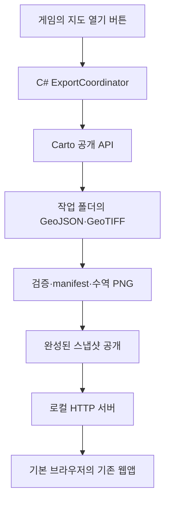

# CS2 City Map 모드 출시 구현 계획

작성일: 2026-09-25

## 1. 확정 방향

Cities: Skylines II에서 **지도 열기 버튼 한 번으로 현재 도시를 Carto로 추출하고, 외부 기본 브라우저에서 현재 웹앱을 표시**한다.

- Carto를 별도 필수 의존 모드로 사용하고 공개 API를 호출한다.
- 현재 React·TypeScript·MapLibre 지도, 검색, 레이어, 상세 정보, 길찾기를 재사용한다.
- C# 코드 모드를 추가하여 게임과 웹앱 사이를 연결한다.
- 빌드된 웹앱을 모드에 포함하고 C# 모드의 로컬 HTTP 서버로 제공한다.
- 최종 사용자는 Node.js 설치, 터미널 명령, 수동 Export, 파일 복사를 하지 않는다.
- 지도는 버튼을 누른 시점의 스냅샷이다. 실시간 동기화와 인게임 지도 렌더링은 이번 출시 범위에 포함하지 않는다.

이 문서는 모드 전환·출시 계획이다. 기존 `implementation_plan.md`는 초기 웹앱 개발 기록으로 보존한다. 아래 경로·클래스 이름·HTTP 경로는 구현 제안이며 실제 구현 과정에서 확정한다.

## 2. 현재 상태와 선행 확인

### 확인된 프로젝트 구조

| 구성 | 현재 동작 | 전환 방향 |
|---|---|---|
| `src/` | React 웹앱과 MapLibre 지도 | 화면과 계산 로직 재사용 |
| `src/MapView.tsx` | `/data`에서 manifest·GeoJSON·수역 PNG 로드 | 실행 중 선택한 스냅샷의 데이터 경로 주입 |
| `src/routing/routing.worker.ts` | 브라우저에서 경로 계산 | 유지, 스냅샷 변경 시 초기화 |
| `scripts/prepare-data.mjs` | Node에서 검증·복사·해시·manifest 생성 | 모드의 런타임 데이터 준비 기능으로 이식 |
| `scripts/prepare-water.mjs` | GeoTIFF 해석·좌표 변환·수역 PNG 생성 | 우선 C# 이식 검증 |
| `package.json` | dev·build 전에 데이터 준비 | 웹앱 빌드와 도시 데이터 준비 분리 |
| `dist/` | 준비된 도시 데이터를 포함할 수 있는 웹 빌드 | 앱 정적 자산만 출시 패키지에 포함 |

### 구현 전에 실제 게임에서 확인할 사항

1. 설치된 게임 버전과 공식 Modding Toolchain의 상태.
2. Paradox Mods에 배포된 Carto 버전과 DLL에 `Carto.IO.IO.Export(Carto.IO.Options)`가 있는지.
3. 해당 버전의 `Options`, `ExportResult`, 출력 파일 이름·폴더·속성 계약.
4. Carto 초기화 및 도시 로딩 완료 후 API를 호출할 안전한 게임 실행 단계.
5. 게임 런타임에서 사용할 HTTP 서버, 브라우저 열기, GeoTIFF·PNG 라이브러리의 호환성.

GitHub 소스에서는 공개 API와 결과 반환을 확인했지만 배포 DLL 및 실제 게임 호출은 아직 검증하지 않았다. 지원 Carto 최소 버전을 추측해서 고정하지 않고 이 단계의 결과로 정한다. API가 배포본에 없다면 API 포함 버전의 확보를 선행 조건으로 삼고, 내부 구현 패치나 소스 동봉으로 자동 전환하지 않는다.

## 3. 사용자 동작과 처리 흐름

1. 사용자가 우리 모드와 Carto를 설치·활성화하고 도시를 불러온다.
2. 게임의 **지도 열기** 버튼을 누른다.
3. 모드가 도시 로딩 상태, Carto 사용 가능 여부, 중복 실행 여부를 확인한다.
4. 새 작업 폴더에 필요한 데이터를 추출한다.
5. 파일 검증, manifest 생성, 수역 PNG 생성을 수행한다.
6. 준비된 스냅샷을 공개 가능한 상태로 전환한다.
7. 로컬 서버의 준비 완료를 확인한 뒤 기본 브라우저에서 해당 스냅샷을 연다.

게임 버튼의 상태는 `대기 → 추출 중 → 지도 준비 중 → 완료/실패`로 표시한다. 측정 가능한 진행률이 없으면 임의의 퍼센트를 표시하지 않는다. 작업 중 재클릭은 새 작업을 만들지 않는다. 완료 후 다시 누르면 현재 도시를 다시 추출하고 새 스냅샷을 연다.

브라우저 자동 열기가 실패하면 준비된 지도 URL과 다시 열기 동작을 제공한다. 추출 실패 시 이전 정상 스냅샷을 보존하되 새 추출에 성공한 것처럼 표시하지 않는다.



## 4. 모듈과 디렉토리 구성

```text
cities-maps/
  src/                         기존 지도 웹앱
  scripts/                     웹 빌드·개발 데이터 준비·패키징
  mod/
    CityMap/                   공식 템플릿 기반 C# 프로젝트
      Mod.cs                   모드 시작·종료
      Export/                  CartoAdapter, ExportCoordinator
      Data/                    SnapshotBuilder, WaterMaskBuilder
      Hosting/                 LocalMapServer
      UI/                      버튼 요청·상태 바인딩
      Properties/              게시 설정
    ui/                        게임 버튼·작업 상태용 UI
  dist/                        웹앱 빌드 산출물
  artifacts/                   모드 패키지 산출물, Git 제외
```

게임 버튼은 공식 설정 UI 버튼으로 API 연동을 먼저 검증하고, 출시 시 도시 플레이 화면에서 접근 가능한 버튼과 상태 표시를 제공한다. 게임 UI와 외부 지도 웹앱은 별도 빌드로 관리한다.

런타임 데이터는 게임이 제공하는 사용자 데이터 경로를 기준으로 `ModsData/CityMap/` 아래에 저장한다. 사용자 이름이나 설치 경로를 하드코딩하지 않는다.

```text
ModsData/CityMap/
  staging/<job-id>/             아직 공개하지 않은 추출·변환 결과
  snapshots/<snapshot-id>/      완성된 데이터와 manifest
```

스냅샷에는 도시 식별 정보, 생성 시각, 게임·Carto·모드 버전, 스키마 버전을 기록한다. 도시 이름만으로 폴더를 구분하지 않는다. 기존 `datasetId`는 데이터 해시 식별자로 유지하고, 저장 경로용 `snapshot-id`와 구분한다.

## 5. Carto 연동

- Carto DLL을 빌드 참조로 사용하되 출시 패키지에 중복 동봉하지 않는다.
- Paradox Mods 게시 설정에서 의존성을 선언하고 실제 구독·활성화·로딩 동작을 확인한다.
- Carto 접근은 `CartoAdapter`에 모아 버전 차이의 영향을 제한한다.
- 사용자의 Carto 저장 설정을 바꾸지 않고 작업별 `Options`를 구성한다.
- 출력 폴더, 파일 이름 규칙, 데이터 종류, 속성, 형상과 좌표계를 명시한다.
- 완료 대화상자·소리는 우리 작업 상태 UI와 중복되지 않도록 옵션을 설정한다.
- `ExportResult.Success`뿐 아니라 `FilesWritten` 및 필수 데이터의 유효성을 확인한다.

### 추출 데이터 계약

| 데이터 | 형상 | 용도 | 실패 처리 |
|---|---|---|---|
| Building | Boundary | 건물 표시·검색·주소 | 잘못된 파일이면 작업 실패 |
| Network | Centerline | 도로·철도·보행로·길찾기 | 잘못된 파일이면 작업 실패 |
| Area | Boundary | 행정구역 | 기본 지도 유지, 상태 표시 |
| POI | Location | 검색·시설·정류장 | 기본 지도 유지, 상태 표시 |
| Route | Centerline | 대중교통 표시·길찾기 | 기본 지도 유지, 상태 표시 |
| Water | Depth GeoTIFF | 수역 마스크 | 기본 지도 유지, 상태 표시 |

현재 코드가 사용하는 속성을 목록화하여 추출 프리셋에 포함한다. 특히 이름·주소·브랜드·용도지역, 도로 방향·제한 속도·분류, 노선 색상·교통수단·정류장 수를 누락하지 않는다. Carto 버전별 정확한 enum과 속성명은 배포 DLL로 검증한다.

GeoJSON은 웹앱이 기대하는 경도·위도로 제공한다. 수심 래스터는 기존 변환 코드가 지원하는 UTM 메타데이터와 정합되도록 설정한다. Carto가 벡터와 래스터에 필요한 좌표계를 한 번의 호출로 제공하지 못하면 내부적으로 순차 추출한다. 사용자 클릭은 한 번으로 유지한다.

빈 도시는 손상 데이터와 구분한다. 기존 준비 스크립트의 빈 필수 데이터 거부 규칙을 검토하고, 유효한 빈 도시에는 지도 범위의 대체값과 빈 상태 화면을 제공한다.

Carto API는 확인한 소스에서 동기 호출 형태다. 게임 ECS 접근이 포함된 추출 전체를 임의로 `Task.Run`에 넣지 않는다. 게임의 안전한 실행 단계에서 호출하고, 완성된 파일에 대한 변환·해시·HTTP 처리는 게임 객체에 접근하지 않는 작업으로 분리한다. 대도시의 추출 중 정지 시간은 실측하여 안내한다.

## 6. 데이터 준비와 웹앱 재사용

### 기본안: C#에서 현재 데이터 계약 생성

`prepare-data.mjs`와 `prepare-water.mjs`의 동작을 기준으로 C#에서 다음을 구현한다.

- GeoJSON 구조·속성·좌표 검사와 bounds 계산.
- 파일별 개수·크기·해시·Object 분포 및 선택 데이터 오류 기록.
- 기존 형식과 호환되는 `manifest.json`과 `datasetId` 생성.
- GeoTIFF 좌표계·NoData·범위 검사 및 `water-mask.png` 생성.
- 임시 폴더에서 모든 작업을 마친 뒤 스냅샷 공개.

수역 변환 라이브러리는 게임 런타임 호환성, 배포 크기, 라이선스를 기준으로 선택한다. 현재 JS 구현과 동일 입력으로 마스크 위치·범위·픽셀 결과를 비교한다. C# 이식이 부적합하다는 검증 결과가 나오면 브라우저 Worker에서 GeoTIFF를 해석하는 대안을 채택할 수 있으나, 최종 사용자에게 Node 설치를 요구하지 않는다.

### 웹앱의 최소 변경 범위

1. `MapView.tsx`의 고정 `/data` 경로를 실행 설정에서 주입받도록 한다.
2. `/snapshots/<id>/...`처럼 특정 스냅샷의 모든 파일을 읽도록 한다.
3. 도시 이름·추출 시각·데이터 상태를 표시한다.
4. 데이터가 바뀌면 지도 상태와 경로 계산 Worker를 새 `datasetId`로 초기화한다.
5. 선택 데이터 오류와 빈 도시를 처리한다.
6. 서버 연결이 끊긴 경우 게임 실행 상태를 확인할 수 있는 메시지를 표시한다.

지도 디자인, 검색 방식, 레이어와 길찾기 계산은 유지한다. 노선·정류장 관계 및 이동 시간은 기존과 같이 추정이며 모드 전환으로 정확도가 개선된다고 표시하지 않는다.

기존 개발용 `npm run dev` 흐름은 유지할 수 있다. 모드 패키징용 웹 빌드는 데이터 준비와 분리하고, 개발자의 도시 GeoJSON·GeoTIFF·생성 PNG가 패키지에 들어가지 않도록 검사한다.

## 7. 로컬 서버와 수명 관리

- C# 모드 내부 서버가 웹 정적 자산과 완성된 스냅샷만 제공한다.
- `127.0.0.1`에만 바인딩하고 사용 가능한 포트를 선택한다. 3000 고정을 요구하지 않는다.
- 웹앱과 데이터는 같은 origin에서 제공한다.
- MIME 형식, JS 모듈·Worker 로딩, 한글 파일 내용과 오류 응답을 검증한다.
- 제공 디렉토리를 제한하고 경로 순회를 차단한다. 파일 시스템 임의 경로를 받는 API는 만들지 않는다.
- Host 검증과 세션 토큰 등으로 다른 웹사이트가 로컬 데이터에 접근하는 경로를 제한한다. 토큰은 로그에 남기지 않는다.
- 초기 버전의 추출 요청은 게임 버튼에서만 받는다. 브라우저는 읽기 전용이다.
- 추출 상태·현재 세션 설정은 캐시하지 않고, 공개된 스냅샷은 불변으로 취급한다.
- 게임 종료·모드 해제 시 listener와 작업 자원을 정리한다.

도시 변경 시 진행 중인 작업을 무효화하고, 이전 도시 결과를 새 도시의 결과로 공개하지 않는다. 추출 API에 안전한 취소 기능이 없다면 강제 중단하지 않고 반환 후 결과를 폐기한다. 종료·씬 전환 시 게임 자원 접근 규칙을 실제 게임에서 확인한다.

초기 버전은 게임 실행 중에 지도 URL을 제공한다. 브라우저에 이미 로드된 화면이 일부 남더라도 게임 종료 후 지속 이용을 보장하지 않는다. 같은 세션에서 연 지도 탭의 스냅샷은 보존하고, 오래된 파일 정리는 활성 스냅샷을 보호하는 규칙과 용량 기준을 정한 뒤 수행한다.

## 8. 단계별 구현과 완료 기준

### 단계 1 — 공식 모드 골격과 Carto 호출 검증

- 공식 Toolchain으로 C# 프로젝트를 만들고 실제 게임에서 로드한다.
- 임시 설정 버튼으로 Carto API를 호출한다.
- 사용할 게임·Carto 버전과 좌표계·파일 계약을 기록한다.

**완료 기준:** 수동 Carto Export 없이 버튼으로 현재 도시의 필수·선택 데이터를 추출하고 결과를 확인한다.

### 단계 2 — 스냅샷 생성

- 추출 프리셋, 결과 검증, manifest, 수역 변환을 구현한다.
- 기존 데이터로 JS 준비 결과와 비교한다.
- 빈 도시, 선택 파일 누락, 필수 파일 손상, 부분 실패를 처리한다.

**완료 기준:** 기존 웹앱과 호환되는 데이터 묶음을 Node 없이 생성하며 실패한 결과는 공개하지 않는다.

### 단계 3 — 외부 브라우저까지 연결

- 웹앱만 빌드하는 경로와 모드 자산 복사 과정을 만든다.
- 로컬 서버, 스냅샷 URL, 기본 브라우저 실행을 연결한다.
- 웹앱의 데이터 경로 주입과 스냅샷 상태 표시를 적용한다.

**완료 기준:** Vite 서버를 실행하지 않은 상태에서 게임 버튼 한 번으로 현재 도시 지도가 표시된다.

### 단계 4 — 출시용 UI와 수명 관리

- 플레이 화면 버튼, 상태·오류·다시 열기를 구현한다.
- 중복 클릭, 재추출, 도시 변경, 게임 종료와 포트 충돌을 처리한다.
- 서버 접근 제한과 임시 파일·스냅샷 보존 규칙을 적용한다.

**완료 기준:** 반복 사용과 도시 전환 시 데이터가 섞이지 않고 게임 종료 시 서버가 정리된다.

### 단계 5 — 패키징과 출시 검증

- 공식 게시 설정, Carto 의존성, 지원 버전, 라이선스 고지를 구성한다.
- DLL·게임 UI·웹앱 자산으로 배포물을 만들고 도시 데이터·개발 의존성 포함 여부를 검사한다.
- 개발 도구가 없는 일반 사용자 환경에서 설치부터 원클릭 표시까지 확인한다.
- 소개 이미지, 한국어·영어 설명, 알려진 제한과 오류 신고용 로그 위치를 준비한다.

**완료 기준:** 출시 패키지만 설치한 환경에서 검색·수역·대중교통·길찾기까지 동작한다. 실제 Paradox Mods 게시 여부는 구현 완료 후 배포 시점에 결정한다.

## 9. 검증 항목

| 범위 | 필요한 검증 |
|---|---|
| 기존 기능 회귀 | 타입 검사·프로덕션 웹 빌드·기존 경로 계산 테스트 |
| 데이터 계약 | 한글, 속성, 방향, 좌표계, bounds, manifest, 수역 정합성 |
| 스냅샷 일관성 | 재추출 중 이전 파일 유지, 부분 결과 비공개, 도시 변경 격리 |
| 사용자 환경 | Node·Vite 없이 실행, 기본 브라우저, 오프라인 사용 |
| 의존성 | Carto 누락·비활성·비호환 버전, 실제 게시본 API |
| 오류 | 포트 충돌, 디스크 오류, 브라우저 실행 실패, 선택 데이터 없음 |
| 성능 | 작은 도시·대도시의 추출 시간, 게임 정지 시간, 메모리, 초기 표시 시간 |
| 수명 | 일시정지, 연속 클릭, 재추출, 세이브 전환, 메뉴 복귀, 게임 종료 |
| 패키지 | 개발자 도시 데이터 없음, Carto DLL 중복 없음, 필요한 자산·고지 포함 |

출시 판단에는 실제 게임 통합 테스트가 필요하다. 웹 빌드나 단위 테스트만 통과한 상태를 모드 검증 완료로 취급하지 않는다. 성능 목표 수치는 첫 실제 도시 측정 후 정한다.

## 10. 참고 자료

- [Carto API 안내](https://github.com/taipei-native/Carto/wiki/Api): 다른 모드의 추출 호출 진입점. 문서는 미완성 상태이므로 소스·배포 DLL과 대조한다.
- [Carto Export 소스](https://github.com/taipei-native/Carto/blob/main/IO/IO.cs): 결과 반환과 완료 효과 처리.
- [Carto Options](https://github.com/taipei-native/Carto/blob/main/IO/Options.cs): 출력 위치·데이터·좌표계 설정.
- [Carto 라이선스](https://github.com/taipei-native/Carto/blob/main/LICENSE.txt): 코드·바이너리를 포함할 경우의 고지 조건.
- [공식 코드 모딩 안내](https://www.paradoxinteractive.com/games/cities-skylines-ii/modding/dev-diary-3-code-modding): Toolchain·템플릿·게시 흐름. 세부 버전과 게시 설정은 설치된 최신 Toolchain으로 확인한다.

참고 링크는 이전 조사에서 확인한 자료다. 구현 시작 시 지원할 배포 버전과 소스 커밋을 기록해 재현 가능한 기준을 만든다.
